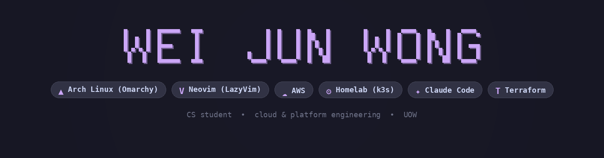

 

Passionate Student from Malaysia 🇲🇾

**About me**

- 🎓️ Computer Science Student at [University of Wollongong](https://www.uow.edu.au/)

- ❤️ I love writing Python, and am focusing on learning Platform + Automation Engineering

- 👨‍🏫 enjoyed teaching tuition part-time

- 😴 Would like to get some more sleep :))

- 🏃‍♂ Fitness is my lifestyle

 

## 🚀 Featured Projects

### [AWSJobRunner](https://github.com/Wong-WeiJun/AWSJobRunner)
> **A robust automation utility to trigger and manage AWS Batch/Lambda jobs via CLI.**
* **Tech Stack:**   
* **Key Feature:** Simplifies complex AWS service interactions into a streamlined command-line interface.
* **Outcome:** Significantly reduced the friction of manual job orchestration in AWS environments.

---

### [FastPipeline](https://github.com/Wong-WeiJun/FastPipeline)
> **A modular data pipeline orchestration system with automated scheduling and API ingestion.**
* **Tech Stack:**    
* **Key Feature:** Implements end-to-end ETL workflows with dynamic schema handling, cron-based scheduling, and job lifecycle tracking.
* **Outcome:** Replicated core concepts of modern data orchestration tools (e.g., pipeline configs, execution tracking), demonstrating production-style data engineering design.

---

### [Driftwatch](https://github.com/Wong-WeiJun/DriftWatch)
> **A cloud infrastructure drift detection platform that scans live AWS environments against expected state.**
* **Tech Stack:**    
* **Key Feature:** FastAPI + boto3 scanners audit EC2, S3, Security Groups, IAM, and RDS for configuration drift, backed by Terraform modules and DynamoDB with a composite key pattern for tracking scan history.
* **Outcome:** Deployed end-to-end on ECS Fargate (ap-southeast-2) with GitHub Actions CI/CD, demonstrating production-style cloud security tooling.
  
---

### [ShiftMate](https://github.com/Wong-WeiJun/VolunteerShiftScheduler)
> **Hackathon Project (MLH Global Hack Week) | A volunteer shift scheduling platform with automated calendar invites.**
* **Tech Stack:**    
* **Key Feature:** Built on a TanStack Router/Query and shadcn/ui frontend with a FastAPI + SQLModel backend, automating volunteer-organizer shift matching and sending confirmation emails with `.ics` calendar attachments via Resend.
* **Outcome:** Shipped a fully deployed app (Vercel + Render + Neon) in a hackathon timeframe, showing rapid full-stack execution under time pressure.

---

 

  

 

